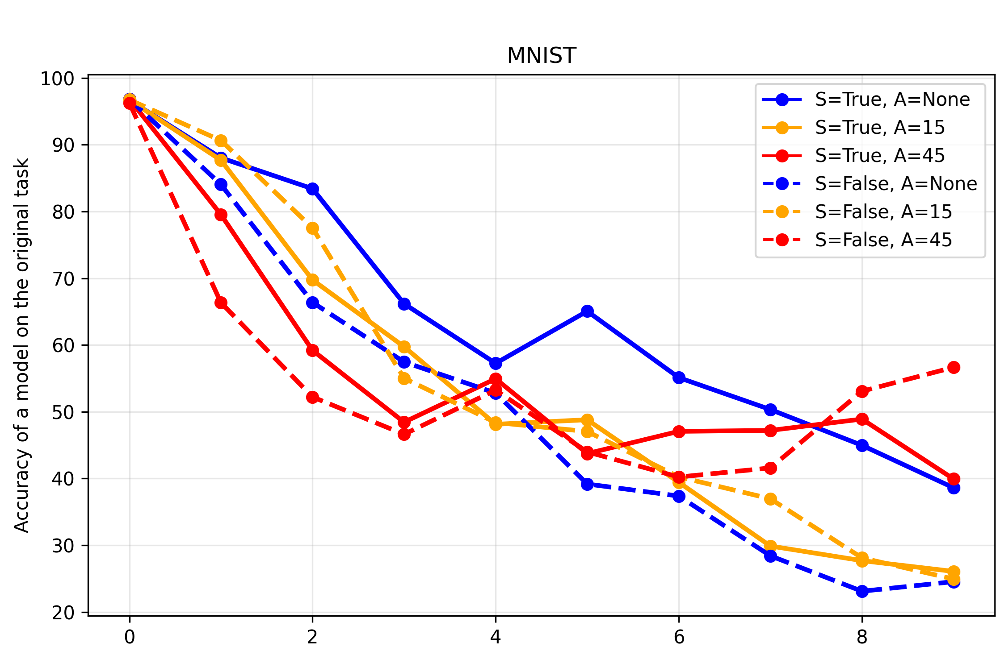
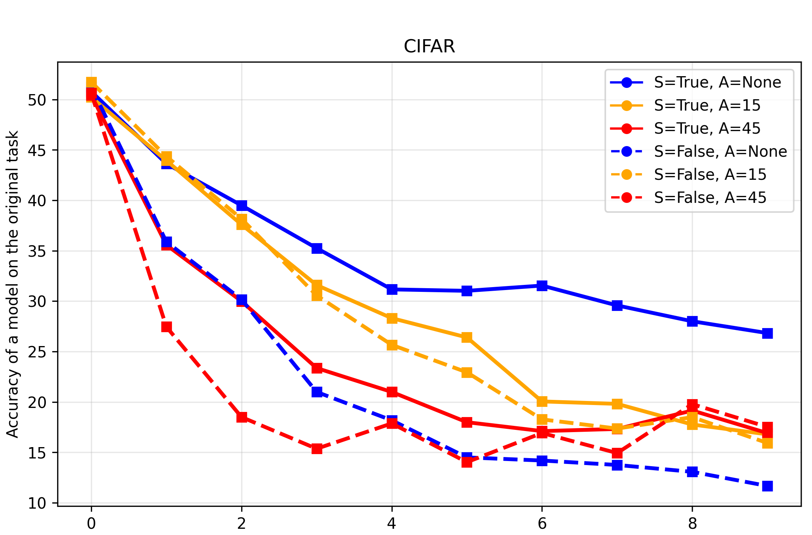

# Does "Superposition of Many Models into One" Solve Continual Learning?

A critical look at the subnetwork approach of Cheung et al. (2019) from a NeuroAI perspective, with experiments on MNIST and CIFAR-10.

## Table of Contents

- [Summary of the original method](#summary-of-the-original-method)
- [Motivation](#motivation)
- [Claim 1: Is the method a general solution to catastrophic forgetting?](#claim-1-is-the-method-a-general-solution-to-catastrophic-forgetting)
- [Claim 2: Is it a good model of continual learning in the brain?](#claim-2-is-it-a-good-model-of-continual-learning-in-the-brain)
- [Results](#results)
- [Conclusions](#conclusions)
- [Bibliography](#bibliography)

## Summary of the original method

Cheung et al. present a method to reduce catastrophic forgetting in deep networks trained in continual learning settings. The idea is to store as many neural subnetworks inside one large network as there are tasks:

- When the large network is trained on task `t`, its `t`-th subnetwork is retrieved and fitted to the data of task `t`.
- When training moves on to task `t+i`, the `(t+i)`-th subnetwork is accessed and fitted to the data of that task.
- Catastrophic forgetting between tasks is mitigated to an extent that is inversely proportional to the degree of interference (parameter sharing) between the subnetworks responsible for different tasks.

In the paper, the different tasks are generated by **randomly permuting the pixels of MNIST images**.

## Motivation

The authors do not frame their approach this way. However, when the paper is covered in a NeuroAI course, it may give the impression that the method is:

1. a decent solution to the catastrophic forgetting problem **in general**, and/or
2. an adequate **model of continual learning in humans** (and brains more broadly).

The results in this repository cast at least some doubt on both claims.

## Claim 1: Is the method a general solution to catastrophic forgetting?

Digit recognition on random permutations of MNIST consists of tasks that have very little, if anything, in common. It therefore makes sense to split a large network into subnetworks that share as few parameters as possible, with each subnetwork responsible for one task.

When consecutive tasks are *somewhat similar*, the picture changes:

- Coarse-grained representations of the input learned in the early layers during task `t` should still be useful for task `t+1`.
- With (nearly) disjoint subnetworks, those representations can hardly be reused, so task `t+1` has to be learned essentially from scratch.
- With disjoint subnetworks, fewer parameters are available for any given task than when all parameters are available for all tasks.

**Hypothesis:** if this reasoning is correct, a classical MLP should outperform the MLP built according to Cheung et al. on tasks where images are, e.g., *slightly rotated* between tasks instead of randomly permuted.

## Claim 2: Is it a good model of continual learning in the brain?

The brain is unlikely to keep its extraordinary object-recognition performance if the wiring between the retina and V1 were randomly changed. Instead, the brain is known for the **robustness** of its object recognition under transformations of visual stimuli such as rotations.

A predictive model of the brain should therefore:

- perform **well** in continual learning settings where inputs are *rotated* across tasks, and
- perform **poorly** when inputs are *randomly permuted*.

## Results

### Experimental conditions

In the plots below:

| Legend entry | Meaning |
|---|---|
| `S=True` (solid lines) | Model with distinct subnetworks per task (Cheung et al.) |
| `S=False` (dashed lines) | Classical MLP that uses all of its parameters for all tasks |
| `A=None` | Random permutation of images between tasks |
| `A=15` | Mild rotation (15°) of images between tasks |
| `A=45` | Significant rotation (45°) of images between tasks |

The y-axis shows the accuracy of the model on the **original task** (task 0) as further tasks are learned (x-axis).

### MNIST

### CIFAR-10

### Observations

**On Claim 1 (generality of the method):**

- On MNIST, both methods perform roughly on par for a mild 15° rotation between tasks.
- The subnetwork method mostly does better when images are rotated by 45° after each task. This is expected: such a rotation is too large for the classical MLP's representations to remain useful for subsequent tasks.
- The same pattern persists on the more realistic CIFAR-10.
- These results do **not** provide conditions under which the classical MLP consistently outperforms the subnetwork model. They do show, however, that the advantage of the subnetwork architecture is **marginal in at least some experimental settings**.

**On Claim 2 (alignment with the brain):**

- Solid lines (distinct subnetworks) are frequently above dashed lines (all parameters shared) on the plots for both MNIST and CIFAR.
- This holds for random permutations, mild rotations (15°) and significant rotations (45°) alike.
- A brain-like model would be expected to favor rotations over permutations, which is not what is seen here. This indicates a **poor predictive alignment** between the brain and MLPs constructed under the continual learning approach of Cheung et al. (2019).

## Conclusions

1. The subnetwork approach works well for tasks that share almost nothing (random permutations), but its advantage over a classical MLP is marginal in some settings where tasks are related (e.g., mild rotations).
2. Because the method does not distinguish between rotated and randomly permuted inputs the way the brain does, it is a weak candidate as a model of biological continual learning.

## Bibliography

Cheung, B., Terekhov, A., Chen, Y., Agrawal, P., & Olshausen, B. (2019). *Superposition of many models into one*. arXiv. https://doi.org/10.48550/arXiv.1902.05522